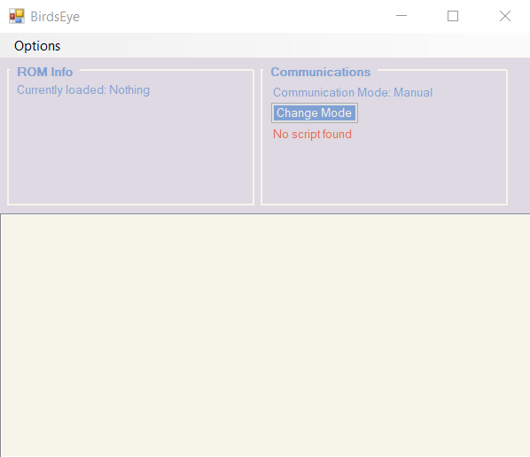
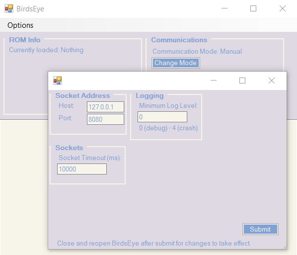

External Tool
=============
The external tool is needed in order for a python script to interact with the emulator.
It functions as a middleman which can call the BizHawk API directly and then send the
received data to the python library through a socket connection.

Options Form
------------
The `Options` button in the external tool opens another form that allows you to configure certain
parts of the external tool, as well as how it should communicate with the python script.

.. note::
    In order for the changes to take effect, you will need to close out of the external tool and
    re-open it.

Logging
-------
Logs from the external tool are sent to the `Log Window` in the BizHawk emulator.

(You can find and enable the Log Window in BizHawk: `View -> Open Log Window`)

The minimum severity log level can be set in the Options Form:

0. Debug: Log level should only be set to 0 if you're trying to debug or develop the
   external tool. Otherwise, the Log Window is going to be flooded with data that is not going
   to be useful to you.
1. Info: Basic information, mostly of changes in the external tool's state.
2. Warning: Information that is important to note, or which could lead to future problems.
3. Error: Unexpected exceptions in the external tool that can be recovered from.
4. Crash: Unexpected exceptions in the external tool that can **not** be recovered from.

Communication Modes
-------------------
The communicaton mode determines how the connected python script can interact with the emulator.

Manual
^^^^^^
The external tool will not execute input states sent from a connected python script,
and the user will still have full control over the emulator.

Things that do not interfere with play, such as reading from memory, are still functional during
this time.

Commandeer
^^^^^^^^^^
The external tool will execute any input states sent from the connected python script,
and the user will be unable to input their own controller inputs into the loaded ROM.